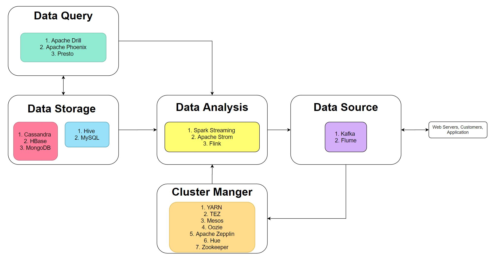

# Hadoop Basics
This is an broad introduction to the Hadoop understanding.
Udemy Course Title:The Ultimate Hands-on Hadoop: Tame your Big Data!

## **Hadoop CheatSheet Buildter**

Platform used: Hortonworks Data Platform
Topics Covered:
## **Hadoop Ecosystem**

## **Querying Data**

## **Managing Cluster**

## **Data Sources into Cluster**

## **Analysing Data**

